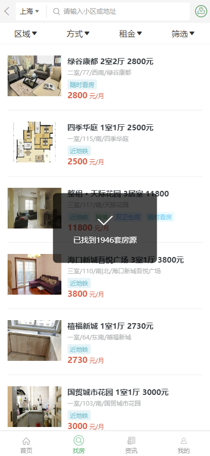
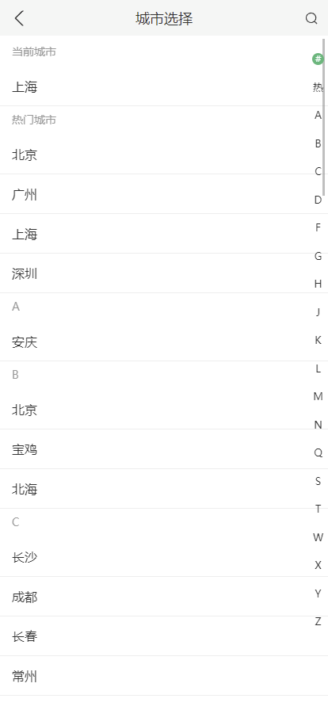
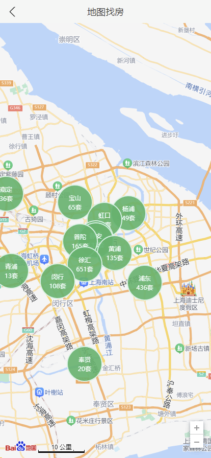
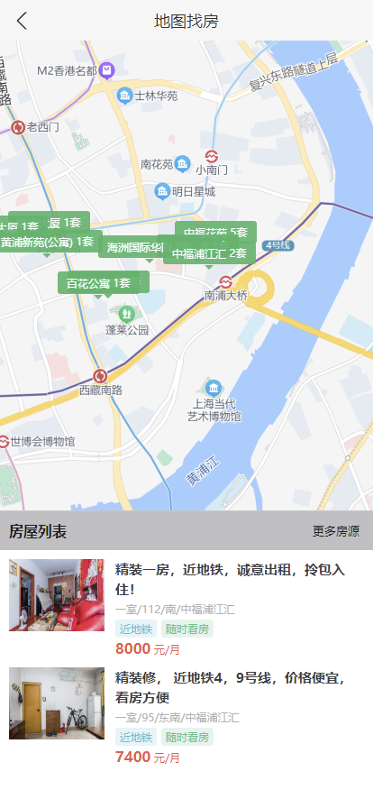
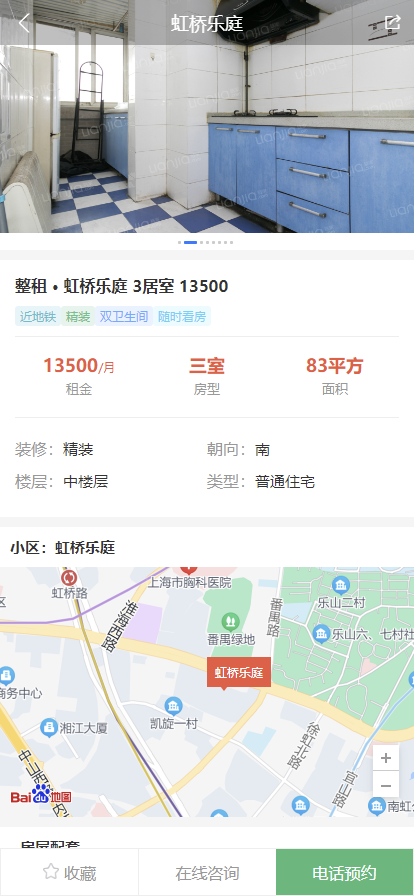
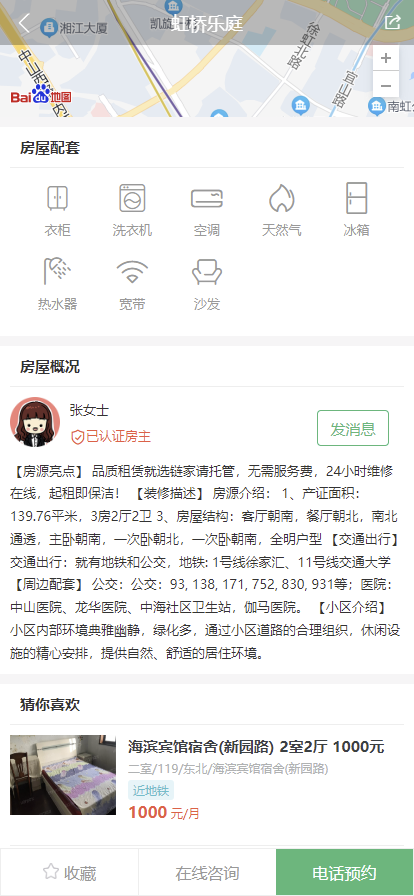
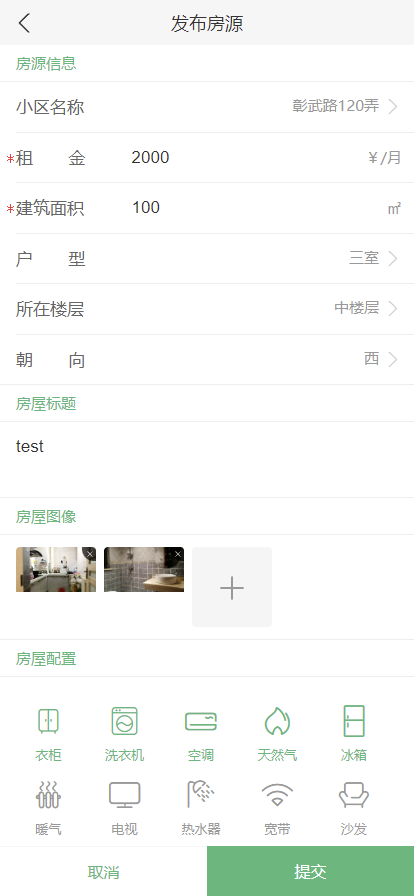
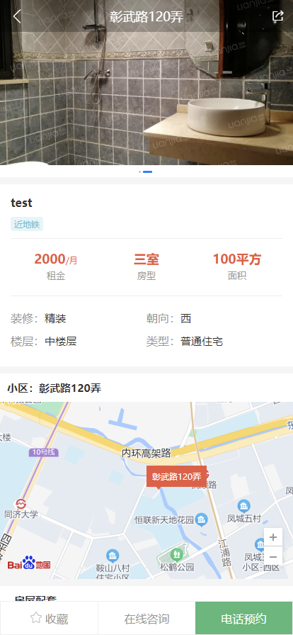

# Rent House Web App


## 1. Introduction

The "Rent House (Web Mobile Web)" project is a mobile web application based on React. 

It is designed with modular, component-based, and engineering principles to provide functionality similar to apps like Beike.

The project addresses the user's need to find housing resources.


## 2. Technology Stack

`react 17`                                  :    JSX + hook

`react-router v6`                   :   Router

 `antd-mobile v5`                    :   UI components

`react-virtualized`               :   Long List

`create-react-app`                 :  Scaffold

`axios`  									  :  Call APIs

`formik+Yup`   						  :  Login & Register Form 

`Baidu Map API` 					 :  Map & Location


## 3. Functionals

The main functional modules of the "Rent House Web App" platform are as follows:

1. **Search for Housing:**
   - Utilize Baidu Maps to search for available housing.
   - Filter housing options based on criteria like current city, transportation, rent, housing facilities, etc.
2. **City Switching:**
   - Incorporate a city selection module for users to switch between cities.
   - Implement a feature for auto-locating the user's current city.
   - Offer different housing options in various cities.
3. **Login Module:**
   - Provide functionality for user registration and login.
   - Allow users to view and modify their personal information.
   - After logging in, users can save housing listings in their favorites and view details in the "My" section.
4. **Housing Details:**
   - Display comprehensive information about each housing listing, including rent, size, amenities, location, property description, features, and contact information.
   - Enable users to add listings to their favorites (requires login) and make phone appointments.
5. **Housing Listing Submission:**
   - Implement a feature for users to publish housing listings.
   - Users can upload relevant information about their properties.
   - Provide a page for users to view their published listings (requires login).
6. **History Records:**
   - Offer a module that allows users to view their browsing history.


## 4. Screenshots Page

####  4.1 Home Page


#### 4.2 Search Page



#### 4.3 News Page


#### 4.4 Profile Page


#### 4.5 City List Page




#### 4.6 Map Search Page 



#### 4.7 Map Details Page 



#### 4.8 Room Descript Page



#### 4.9 Room Details Page



#### 4.10 My Favorites None Page 


#### 4.11 My Favorites  Page 


#### 4.12 My Rent Page


#### 4.13 Post House Page



#### 4.14 Post House Detail Page




## 5. How to run

#### 5.1 Firstly,  run the server 

Follow the instructions of the  backend server's README.md 

```
server/server_backend/README.md
```

#### 5.2 Then start the application

```shell
cd /
yarn install  #install the denpendencies
yarn start    # start the app 
```


## 6. Others 

If you have any specific questions or need help with anything related to React development or this project, feel free to ask, my email is stoneyezhenxu@gmail.com
